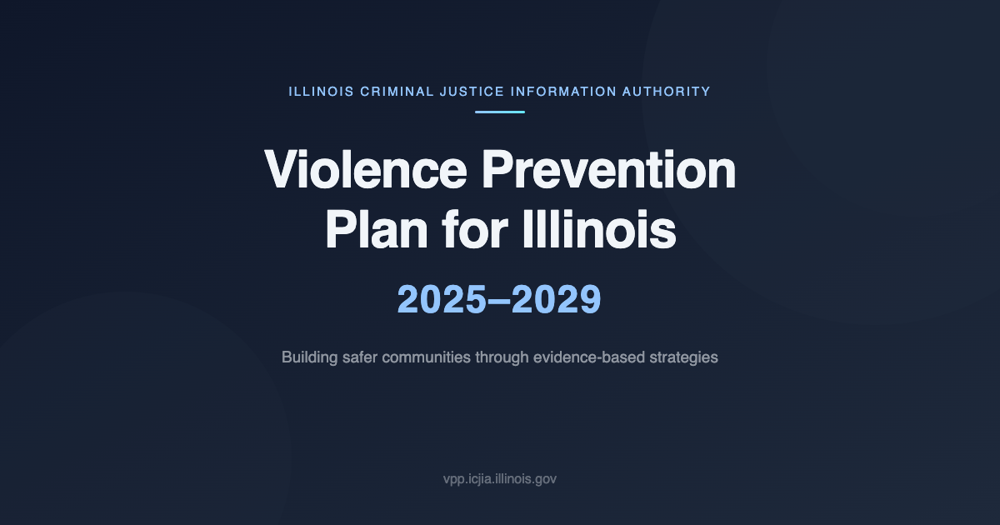

# Statewide Violence Prevention Plan for Illinois: 2025-2029

<p align="center">
  
</p>


The first Statewide Violence Prevention Plan, for 2020-2024, was released in 2021. Since then, a
variety of implementation, research, and activities have taken place. The Ad Hoc Violence Prevention
Committee and its workgroups reviewed these activities, reports, and research, discussing ways in
which this work could be used to inform the next violence prevention plan, collectively writing the
2025-2029 goals and recommendations.

## Project Overview

This project serves as the official web presence for the Statewide Violence Prevention Plan for Illinois: 2025-2029. Built with **Astro 6.4** (static output) and featuring:

- **Astro 6.4** with static site generation — zero JS shipped unless explicitly opted in
- **Tailwind CSS 4** utility-first styling with a custom `@theme` token layer
- **Alpine.js 3** for lightweight client-side interactivity (menus, search UI, accordions)
- Accessibility-first development (WCAG 2.1 AA + Illinois IITAA 2.1 compliant)
- Content managed via Astro content collections (local markdown/MDX — no CMS dependency)
- Full-text client-side search powered by **Fuse.js** with a defuddle-generated index
- Self-hosted **Plausible** analytics (no third-party tracking cookies)
- **astro-icon** (Material Design Icons, tree-shaken inline SVG)
- Self-hosted fonts via **@fontsource** (Roboto + Raleway, latin subset)
- Optimised images via Astro's built-in `<Image>` component (Sharp)
- Lighthouse scores: Performance ~99 · Accessibility 100 · Best Practices 100 · SEO 100

## Changelog

See [CHANGELOG.md](CHANGELOG.md) for a complete history of changes, including security fixes, accessibility improvements, and feature additions.

## Production Site

The official production site is available at:

**[https://vpp.icjia.illinois.gov](https://vpp.icjia.illinois.gov)**

This site contains the complete Violence Prevention Plan with full accessibility features, search functionality, and comprehensive documentation.

## Access the Violence Prevention Plan

The Statewide Violence Prevention Plan for Illinois: 2025-2029 is available in multiple formats to serve different user needs:

### For Human Readers

- **[Read Online](https://vpp.icjia.illinois.gov)**: Interactive web version with full navigation, search, and accessibility features
- **[Download PDF](https://vpp.icjia.illinois.gov/files/Full_Report_Statewide_Violence_Prevention_Plan_2025-2029_2025_Update.pdf)**: Complete plan as a downloadable PDF document

### Machine-Readable Formats for AI & Developers

For AI models, researchers, and developers who need programmatic access to the Violence Prevention Plan text:

- **[llms.txt](https://vpp.icjia.illinois.gov/llms.txt)**: Optimized format following the [llms.txt standard](https://llmstxt.org/) for AI model consumption and analysis
- **[JSON Format](https://vpp.icjia.illinois.gov/vpp-plan-2025-2029.json)**: Structured data in JSON format for web applications and APIs
- **[YAML Format](https://vpp.icjia.illinois.gov/vpp-plan-2025-2029.yaml)**: Human-readable structured data format for configuration and data exchange

These machine-readable formats enable:

- **AI Analysis**: Large language models can directly consume the llms.txt format for comprehensive plan analysis
- **Research Applications**: Structured data formats support academic research and policy analysis
- **Developer Integration**: JSON format facilitates integration with custom applications and data visualization tools

This multi-format approach ensures the Violence Prevention Plan is accessible to both human readers and automated systems, supporting transparency and enabling innovative uses of public policy data.

## Development

### Prerequisites

- Node.js 22+
- pnpm 10+

### Quick start

```bash
# From the repo root — kills stale port, clears caches, starts dev server
./start-dev-server
```

Or launch manually:

```bash
cd astro && pnpm dev       # http://localhost:4321
```

### Build & preview

```bash
cd astro && pnpm build     # static build (prebuild step auto-generates references JSON + search index)
cd astro && pnpm preview   # locally preview the production build
```

### Project structure

```
astro/
├── src/
│   ├── pages/             # File-based routes
│   ├── layouts/
│   │   └── BaseLayout.astro
│   ├── components/
│   │   ├── chrome/        # Header, footer, nav
│   │   ├── home/          # Home-page sections
│   │   ├── content/       # Content renderers
│   │   └── ui/            # Shared UI primitives
│   ├── content/
│   │   ├── plan/          # Plan chapter markdown
│   │   ├── legal/         # Legal/privacy pages
│   │   └── news/          # News articles
│   ├── data/              # Nav + home data files
│   ├── lib/
│   │   └── seo.ts         # Per-page SEO helpers
│   ├── scripts/           # Client-side search + reference islands
│   └── styles/
│       └── global.css     # Tailwind entry point + @theme tokens
├── public/                # Static assets (_headers, _redirects, OG image, …)
├── scripts/               # Build-time generators (references JSON, search index)
└── package.json
docs/                      # Migration checklist, specs, audits
```

### Editing content

Edit markdown files in `astro/src/content/...`. The `prebuild` step (run automatically by `pnpm build`) regenerates the Fuse.js search index and references JSON. For local iteration, restart the dev server after adding new content files.

## Accessibility

This application targets **WCAG 2.1 AA compliance** and meets **Illinois IITAA 2.1 Standards**. An automated accessibility audit using axe-core 4.10.2 on March 24, 2026 found **zero violations across all 23 pages** (20 application pages + 3 documentation pages).

### What This Means

Every page on this site has been verified to meet the Web Content Accessibility Guidelines (WCAG) 2.1 Level AA standard. This ensures the site is usable by people with a wide range of disabilities, including those who use screen readers, keyboard-only navigation, or require high-contrast visuals.

### Key Accessibility Features

- **High contrast colors**: All text exceeds the required 4.5:1 contrast ratio, with most elements reaching 8:1 or higher — well above the minimum standard
- **Keyboard navigation**: Every feature on the site can be accessed without a mouse, with visible focus indicators showing where you are on the page
- **Screen reader support**: The site works with assistive technologies like NVDA, JAWS, VoiceOver, and TalkBack, with proper announcements for dynamic content changes
- **Mobile-friendly touch targets**: All buttons and links meet the 44px minimum size for comfortable touch interaction
- **Reduced motion support**: Animations are automatically disabled for users who have set a preference for reduced motion in their operating system
- **Skip links**: Keyboard users can skip directly to main content without tabbing through navigation
- **Proper document structure**: Headings, landmarks, and semantic HTML ensure content is logically organized for assistive technologies
- **Image descriptions**: All content images include descriptive alt text; decorative images are properly hidden from screen readers

### Compliance Standards

- **WCAG 2.1 AA**: Fully compliant across all four principles (Perceivable, Operable, Understandable, Robust)
- **Illinois IITAA 2.1**: Meets all [Illinois Information Technology Accessibility Act](https://doit.illinois.gov/initiatives/accessibility/iitaa/iitaa-2-1-standards.html) requirements
- **Section 508**: Federal accessibility standards compliance
- **ADA Digital Rule**: Americans with Disabilities Act web accessibility compliance

### Audit History

| Date | Tool | Result |
|------|------|--------|
| April 8, 2026 | Google Lighthouse | CLS eliminated on all pages; avg perf 77→93; a11y 100 on all pages |
| March 24, 2026 | axe-core 4.10.2 | 0 violations across 23 pages |
| December 22, 2025 | axe-core | 98.8% compliance (all issues subsequently fixed) |
| October 29, 2025 | Google Lighthouse + axe-core | Full audit, all issues resolved |
| September 15, 2025 | Lighthouse | Skip link, footer, and dark mode fixes |
| August 11, 2025 | Lighthouse | Accessibility and performance optimization |

For detailed accessibility reports, see the [Accessibility Report](https://vpp.icjia.illinois.gov/docs/accessibility/).

## Security

This application is deployed as a **static site on Netlify** with no server-side code. This architecture eliminates entire categories of security vulnerabilities (such as SQL injection, server-side request forgery, and authentication bypass) because there is no server to attack — the site consists entirely of pre-built HTML, CSS, and JavaScript files.

### What This Means

The site collects no user data, stores no passwords, and processes no payments. There are no databases, no login systems, and no APIs that could be compromised.

### Security Measures in Place

- **Content Security Policy (CSP)**: A strict policy controls what resources the browser is allowed to load. Only content from the site itself and a small number of trusted sources (self-hosted Plausible analytics) are permitted.
- **HTTP Security Headers**: The full recommended suite of security headers is deployed via `astro/public/_headers`, including HSTS, X-Frame-Options, X-Content-Type-Options, and Permissions-Policy.
- **Input Sanitization**: All user input (search queries) goes through multi-layer sanitization to prevent cross-site scripting (XSS) attacks.
- **Source Map Protection**: Source maps are disabled in production builds to prevent information disclosure.
- **Domain Redirect**: The legacy Netlify domain redirects to the official `vpp.icjia.illinois.gov` domain with a permanent 301 redirect (managed via `astro/public/_redirects`).
- **Smart Caching**: HTML pages always check for updates on each visit, while static assets (JavaScript, CSS, images) are cached efficiently.

### Security Standards

- **OWASP Top 10**: Protected against all major web vulnerability categories
- **CSP Level 3**: Modern Content Security Policy implementation
- **HSTS Preload**: Included in browser preload lists for mandatory HTTPS

### Red Team Review (March 2026)

A red team security review was conducted on March 24, 2026, examining the application from an attacker's perspective. The review covered XSS vectors, open redirects, DOM clobbering, prototype pollution, CSP bypass potential, dependency supply chain, information disclosure, path traversal, clickjacking, and client-side storage. All identified issues were addressed. See [CHANGELOG.md](CHANGELOG.md) for details.

_Last Security Review: March 24, 2026_

## License

See [LICENSE](LICENSE) for license details.

### External Standards and Guidelines

- **[WCAG 2.1 Guidelines](https://www.w3.org/TR/WCAG21/)**: Web Content Accessibility Guidelines 2.1
- **[Illinois Information Technology Accessibility Act (IITAA) 2.1 Standards](https://doit.illinois.gov/initiatives/accessibility/iitaa/iitaa-2-1-standards.html)**: State accessibility requirements
